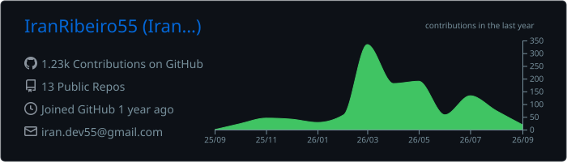
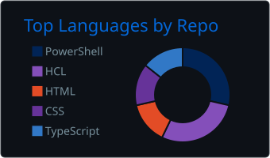
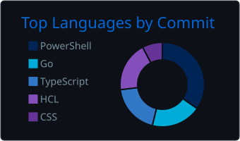
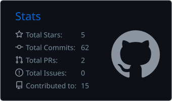
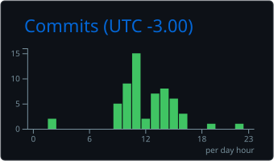

<h1 align="center">Iran Ribeiro</h1>

<h3 align="center">
DevOps · Cloud · Platform Engineering · Azure · Kubernetes · Infrastructure as Code
</h3>

<p align="center">
Building secure, automated and scalable infrastructure.<br/>
Cloud platforms · CI/CD · Kubernetes · IaC · Identity · Automation · Production Operations
</p>

<p align="center">
  <a href="https://iranribeiro.com">
    
  </a>
  <a href="https://www.linkedin.com/in/iran-ribeiro-36284a1bb/">
    
  </a>
  <a href="mailto:iran.ribeiro55@gmail.com">
    
  </a>
  
</p>

---

## 👨‍💻 About Me

I'm a **DevOps / Cloud / Platform Engineer** based in Brasília, Brazil, working across cloud infrastructure, automation, identity, CI/CD and production environments.

My current technical ecosystem includes **Microsoft Azure, Entra ID, Intune, Microsoft 365 and PowerShell**, combined with DevOps and infrastructure technologies such as **Terraform, Kubernetes, Docker, GitHub Actions, Azure DevOps, Linux and networking**.

I focus on transforming manual infrastructure and operational processes into **versioned, repeatable, secure and automated workflows**.

My professional background also includes infrastructure work at **PRODASEN — Senado Federal** and data / automation initiatives at **Banco do Brasil**.

### Current engineering focus

```text
Cloud              Azure · AKS · Microsoft 365
Containers         Kubernetes · Docker · Helm
IaC                Terraform · Infrastructure as Code
CI/CD              GitHub Actions · Azure DevOps · GitLab CI
Identity           Entra ID · Active Directory · RBAC · Conditional Access
Automation         PowerShell · Python · Microsoft Graph
Systems            Linux · Windows Server
Networking         DNS · Nginx · Reverse Proxy · TCP/IP
Virtualization     VMware · Hyper-V
Engineering        Git · GitHub · APIs · Troubleshooting · Automation
```

---

# ⚙️ DevOps & Cloud Stack

## ☁️ Cloud & Identity

<p>


</p>

---

## ☸️ Containers & Platform Engineering

<p>


</p>

---

## 🏗️ Infrastructure as Code

<p>


</p>

---

## 🚀 CI/CD

<p>


</p>

---

## 🤖 Automation & Development

<p>


</p>

---

## 🖥️ Infrastructure & Operations

<p>


</p>

---

# 🚀 Featured Engineering Projects

These repositories are public labs created to demonstrate infrastructure, cloud, automation and platform engineering practices.

Production tenants, company infrastructure, credentials and sensitive configurations remain private.

---

## ☸️ Azure AKS Platform

### [IranRibeiro55/azure-aks-platform](https://github.com/IranRibeiro55/azure-aks-platform)

Azure Kubernetes platform provisioned using **Terraform and Infrastructure as Code**.

### Architecture

```text
                        GitHub
                           │
                           ▼
                   GitHub Actions
                           │
                        OIDC
                           │
                           ▼
                    Microsoft Azure
                           │
              ┌────────────┼────────────┐
              │            │            │
              ▼            ▼            ▼
            VNet          ACR        Key Vault
              │            │
              └──────┬─────┘
                     │
                     ▼
                    AKS
                     │
                     ▼
                Kubernetes
```

### Engineering concepts

- Azure Virtual Network
- Azure Kubernetes Service
- Azure Container Registry
- Azure Key Vault
- Terraform
- Infrastructure as Code
- GitHub Actions
- Terraform validation
- OIDC authentication
- Azure RBAC
- Secretless CI/CD authentication

**Stack**

`Azure` `AKS` `Terraform` `Kubernetes` `GitHub Actions` `OIDC` `Key Vault`

---

## 🔐 GitHub OIDC → Azure

### [IranRibeiro55/github-oidc-azure](https://github.com/IranRibeiro55/github-oidc-azure)

Passwordless authentication architecture between **GitHub Actions and Microsoft Azure**.

```text
GitHub Actions
      │
      │ OIDC Token
      ▼
Microsoft Entra ID
      │
      ▼
Federated Identity Credential
      │
      ▼
Managed Identity
      │
      ▼
Azure RBAC
      │
      ▼
Azure Resources
```

### Engineering concepts

- OpenID Connect
- Federated Identity Credentials
- User Assigned Managed Identity
- Microsoft Entra ID
- Azure RBAC
- GitHub Actions
- Secretless authentication
- CI/CD security

**Stack**

`Azure` `Entra ID` `OIDC` `Terraform` `GitHub Actions`

---

## 🪪 Hybrid Identity Lab

### [IranRibeiro55/hybrid-identity-lab](https://github.com/IranRibeiro55/hybrid-identity-lab)

Architecture and documentation for hybrid Microsoft identity environments.

### Topics

- Microsoft Entra ID
- Active Directory
- Microsoft Intune
- Conditional Access
- Windows Autopilot
- Break-glass accounts
- Identity architecture
- Security controls
- Hybrid environments

**Stack**

`Entra ID` `Intune` `Active Directory` `Microsoft 365`

---

## ⚡ Entra & Intune Operations

### [IranRibeiro55/entra-intune-ops](https://github.com/IranRibeiro55/entra-intune-ops)

PowerShell automation for Microsoft Entra ID and Intune operational visibility.

### Automation examples

- Directory role inventory
- Intune compliance reporting
- Stale device detection
- Conditional Access inventory
- Microsoft Graph queries
- Environment visibility

Designed primarily around **read-only operational automation**.

**Stack**

`PowerShell` `Microsoft Graph` `Entra ID` `Intune`

---

## 🤖 BIA-SHELL

### [IranRibeiro55/BIA-SHELL](https://github.com/IranRibeiro55/BIA-SHELL)

PowerShell assistant designed for Windows support and infrastructure operations.

### Features

- Machine diagnostics
- System information
- Operational playbooks
- Azure authentication
- Support automation
- Windows troubleshooting
- Multilingual interface

Languages:

🇧🇷 Portuguese  
🇺🇸 English  
🇪🇸 Spanish

**Stack**

`PowerShell` `Windows` `Azure` `Automation`

---

# 🔄 Engineering Workflow

```text
Developer / Engineer
        │
        ▼
       Git
        │
        ▼
   Pull Request
        │
        ▼
┌──────────────────┐
│       CI/CD      │
│                  │
│ GitHub Actions   │
│ Azure DevOps     │
│ GitLab CI        │
└────────┬─────────┘
         │
         ▼
┌──────────────────┐
│ Infrastructure   │
│    as Code       │
│                  │
│    Terraform     │
└────────┬─────────┘
         │
         ▼
┌──────────────────────────────┐
│            Azure             │
│                              │
│ VNet · AKS · ACR · Key Vault│
│ Identity · RBAC · Networking │
└──────────────┬───────────────┘
               │
               ▼
       ┌───────────────┐
       │  Kubernetes   │
       │               │
       │ AKS · Docker  │
       │ Helm · Nginx  │
       └───────┬───────┘
               │
               ▼
       Production Operations
               │
       ┌───────┴────────┐
       │                │
   Monitoring      Troubleshooting
       │                │
       └───────┬────────┘
               │
          Reliability
```

---

# 📊 GitHub Engineering Metrics

These cards are generated automatically inside this repository using **GitHub Actions**.

<p align="center">
  
</p>

<p align="center">
  
  
</p>

<p align="center">
  
  
</p>

> GitHub metrics represent GitHub-visible activity. Corporate repositories, private production environments and confidential infrastructure are intentionally not exposed publicly.

---

# 🧠 Engineering Areas

My work and technical interests include:

- Cloud Infrastructure
- Platform Engineering
- Infrastructure as Code
- Kubernetes
- Container orchestration
- CI/CD architecture
- Infrastructure automation
- Identity and Access Management
- Microsoft Azure
- Microsoft Entra ID
- Azure Kubernetes Service
- Linux
- Windows infrastructure
- Hybrid infrastructure
- DNS
- Networking
- Reverse proxies
- Troubleshooting
- Production operations
- Security
- Availability
- Scalability
- Monitoring
- Logging
- APIs
- Microsoft Graph
- PowerShell automation
- Python automation

---

# 🔭 Currently Exploring

```text
Platform Engineering
├── Kubernetes
├── Azure Kubernetes Service
├── Terraform
├── CI/CD
├── GitOps
├── Observability
├── Cloud Security
└── Developer Platforms
```

---

# 💡 Engineering Principles

```text
Automate repetitive operations.
Version infrastructure.
Avoid long-lived credentials.
Design for failure.
Make deployments reproducible.
Keep infrastructure observable.
Treat security as architecture.
Troubleshoot before restarting.
```

---

# 🌎 Languages

🇧🇷 **Portuguese** — Native

🇪🇸 **Spanish** — Professional / working proficiency

🇺🇸 **English** — Basic, actively improving technical and professional communication

---

# 🌍 Open to Opportunities

Interested in **Senior / Staff engineering opportunities** involving:

- DevOps Engineering
- Cloud Engineering
- Platform Engineering
- Site Reliability Engineering
- Infrastructure Engineering
- Software Engineering
- Cloud Architecture

Particularly interested in environments using:

```text
Azure
Kubernetes
Terraform
Infrastructure as Code
CI/CD
Platform Engineering
Cloud Infrastructure
Automation
Identity
Linux
```

Open to opportunities in:

🇧🇷 Brazil  
🇪🇸 Spain  
🇨🇱 Chile  
🇪🇺 Europe  
🌎 International Remote

Contract models:

`CLT` · `PJ` · `B2B` · `Contractor`

Open to relocation when supported by the employer.

---

# 📫 Connect

<p align="center">

<a href="https://iranribeiro.com">
  
</a>

<a href="https://www.linkedin.com/in/iran-ribeiro-36284a1bb/">
  
</a>

<a href="mailto:iran.ribeiro55@gmail.com">
  
</a>

</p>

---

<p align="center">
<strong>
Automate what is repetitive · Version what is infrastructure · Monitor what is production
</strong>
</p>
